# electrocasa-lakehouse

## 1. Descripción del proyecto

ElectroCasa es una cadena minorista de electrodomésticos con información distribuida en seis fuentes heterogéneas:

- Ventas por sucursal.
- Catálogo de productos.
- Empleados de RR. HH.
- Reseñas de clientes.
- Devoluciones.
- Tracking de envíos desde Azure SQL Database.

El objetivo es construir una plataforma de datos de extremo a extremo sobre Azure Databricks que permita centralizar estas fuentes, mejorar progresivamente su calidad, mantener trazabilidad y generar información analítica preparada para negocio.

La solución implementa:

- Arquitectura Medallion.
- Lakeflow Declarative Pipelines.
- Auto Loader.
- `COPY INTO`.
- Lakehouse Federation.
- Unity Catalog.
- Expectativas de calidad.
- Cuarentena.
- Historización de empleados.
- Column masking.
- Lakeflow Jobs.
- Reintentos y alertas.
- Schedule diario.
- Declarative Automation Bundles.
- Targets `dev` y `prod`.
- Control de versiones mediante GitHub.

Los datos utilizados corresponden al escenario académico del proyecto.

---
## 2. Objetivos

### Objetivo general

Construir una plataforma de datos sobre Azure Databricks capaz de integrar múltiples fuentes, aplicar transformación y calidad mediante una arquitectura Medallion, generar resultados analíticos y aplicar gobierno, seguridad, orquestación y despliegue reproducible.

### Objetivos específicos

1. Integrar las seis fuentes del caso.
2. Aplicar distintos métodos de ingesta según el patrón de cada fuente.
3. Implementar las capas Bronze, Silver y Gold.
4. Aplicar reglas de calidad.
5. Gestionar registros rechazados mediante cuarentena.
6. Mantener la historización de empleados.
7. Construir tablas Gold orientadas a negocio.
8. Integrar Azure SQL mediante Lakehouse Federation.
9. Aplicar permisos diferenciados mediante Unity Catalog.
10. Proteger `dni` y `salario` mediante masking.
11. Orquestar el flujo mediante Lakeflow Jobs.
12. Incorporar retries, alertas y programación.
13. Gestionar el despliegue mediante Declarative Automation Bundles.

---
## 3. Arquitectura de la solución

```text
                              FUENTES
        ┌─────────────────────────────────────────┐
        │ Ventas                 CSV              │
        │ Productos              JSON             │
        │ Empleados              CSV              │
        │ Reseñas                JSON             │
        │ Devoluciones           CSV              │
        │ Tracking               Azure SQL        │
        └───────────────────────┬─────────────────┘
                                │
                                ▼
                       ┌─────────────────┐
                       │     BRONZE      │
                       │                 │
                       │ Raw / auditoría │
                       │ Auto Loader     │
                       │ COPY INTO       │
                       │ Federation      │
                       └────────┬────────┘
                                │
                                ▼
                       ┌─────────────────┐
                       │     SILVER      │
                       │                 │
                       │ Limpieza        │
                       │ Tipificación    │
                       │ Calidad         │
                       │ Cuarentena     │
                       │ Historización  │
                       │ Masking         │
                       └────────┬────────┘
                                │
                                ▼
                       ┌─────────────────┐
                       │      GOLD       │
                       │                 │
                       │ KPIs            │
                       │ Agregaciones    │
                       │ Analítica       │
                       └─────────────────┘

                 ORQUESTACIÓN
        Bronze_ingestion → Electrocasa_pipeline

                 DESPLIEGUE
          Bundle → dev / prod
```
---

### Evidencia — Arquitectura

> Grafo del Pipeline con Bronze, Silver, Gold y las dependencias.

> 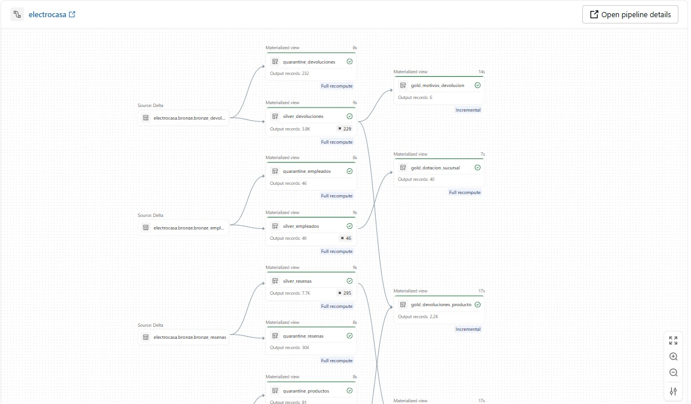

> 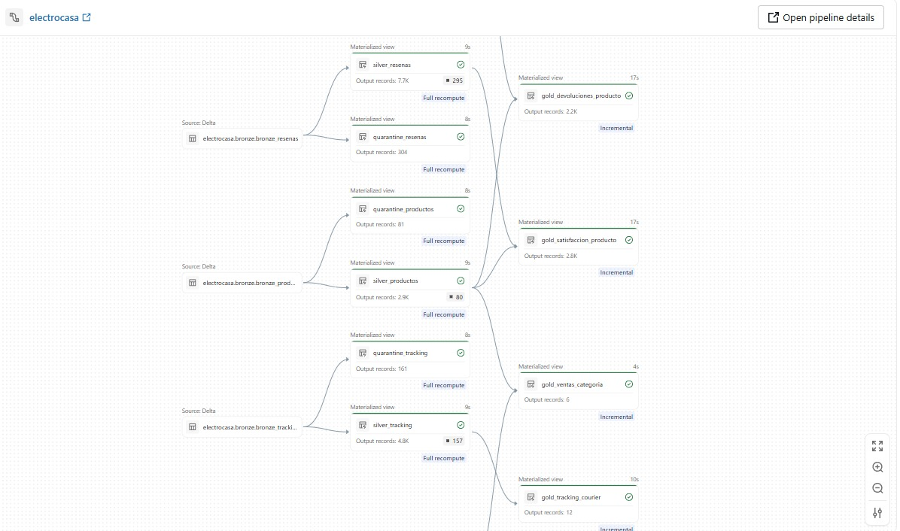

> 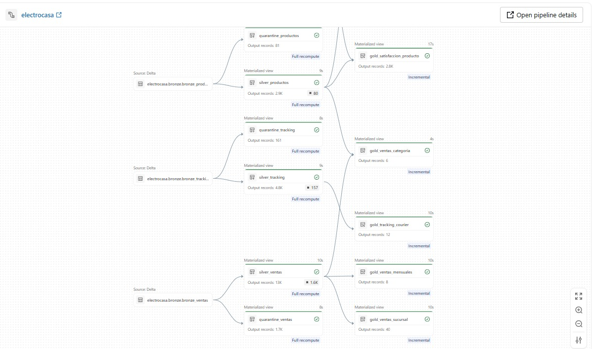

> Estructura del Repositorio

>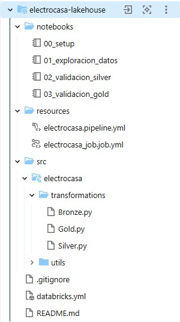
---

## 4. Estructura del repositorio en Github

 >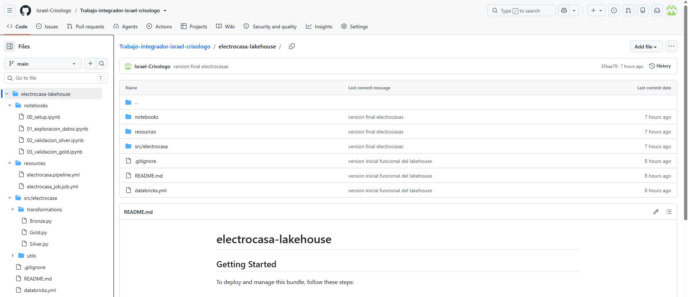
---
## 5. Fuentes y métodos de ingesta

> | Fuente | Formato | Patrón | Método |
|---|---|---|---|
| Ventas por sucursal | CSV | Diaria / incremental | Auto Loader |
| Catálogo de productos | JSON | Snapshot | COPY INTO |
| Empleados RR. HH. | CSV | Eventos por lote | Auto Loader |
| Reseñas | JSON | Incremental | Auto Loader |
| Devoluciones | CSV | Diaria / incremental | Auto Loader |
| Tracking | Azure SQL | Bajo volumen / bajo demanda | Lakehouse Federation |

> ### Justificación

> **Auto Loader** se utiliza para las fuentes de archivos con llegada incremental.

> **COPY INTO** se utiliza para el snapshot del catálogo, aprovechando su comportamiento reintentable e idempotente.

> **Lakehouse Federation** se utiliza para Tracking porque el origen ya se encuentra en Azure SQL y el caso requiere una consulta de bajo volumen. 

> ### Evidencia  — Auto Loader
> 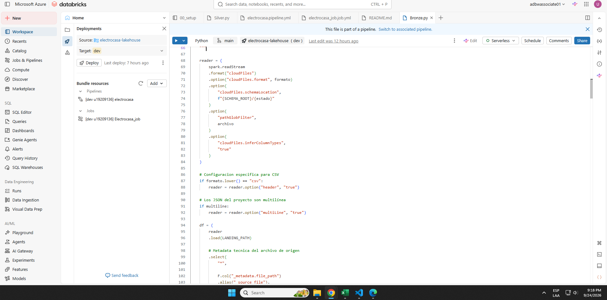
> ### Evidencia — COPY INTO
> 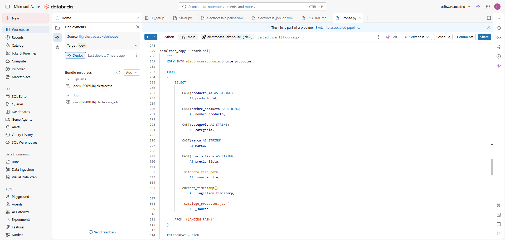
> ### Evidencia  — Federation
> 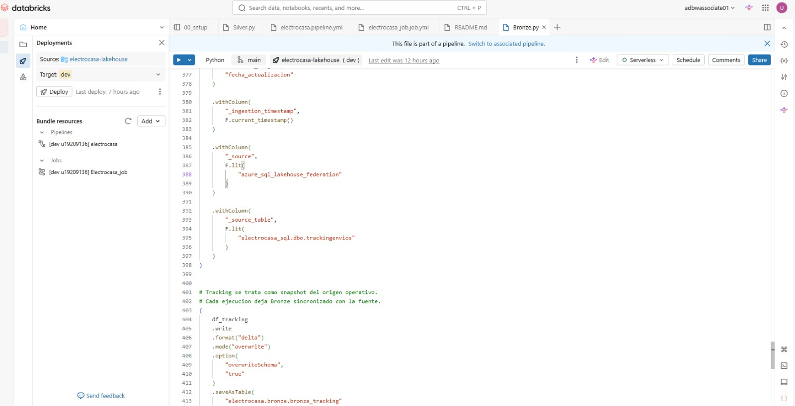
> ### Resultado
> 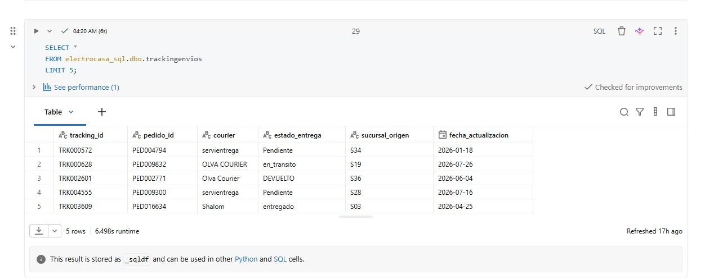

---

## 6. Capa Bronze

Schema:

```text
electrocasa.bronze
```

Tablas principales:

```text
bronze_ventas
bronze_productos
bronze_empleados
bronze_resenas
bronze_devoluciones
bronze_tracking
```

Bronze conserva la información próxima al origen y los metadatos técnicos necesarios para trazabilidad.

La zona de landing se gestiona mediante:

```text
electrocasa.bronze.landing
```

> ### Evidencia — Bronze
> 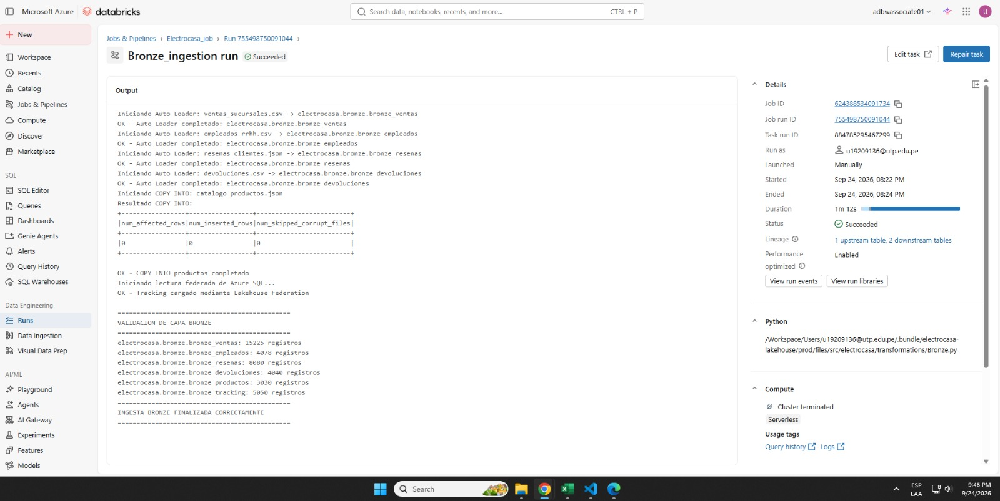

> ### Evidencia — Volume
> 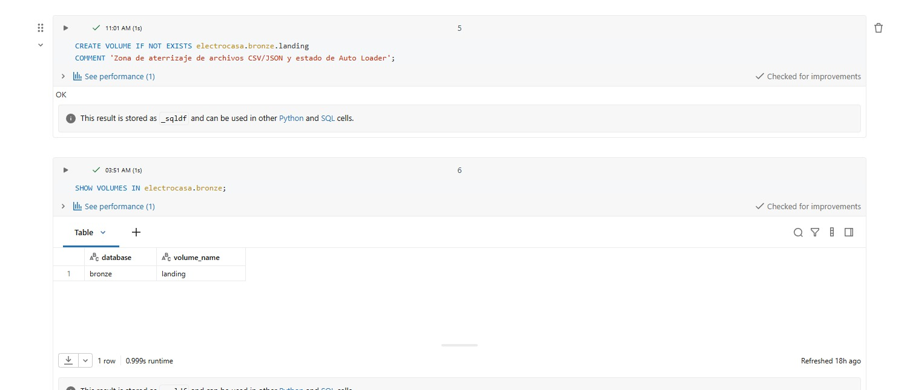

---

## 7. Capa Silver

Schema:

```text
electrocasa.silver
```

Tablas:

```text
silver_ventas
silver_productos
silver_empleados
silver_resenas
silver_devoluciones
silver_tracking
```

Silver aplica:

- Tipificación.
- Limpieza.
- Estandarización.
- Deduplicación.
- Validaciones.
- Historización.
- Protección de información sensible.

### Evidencia 8 — Silver

> 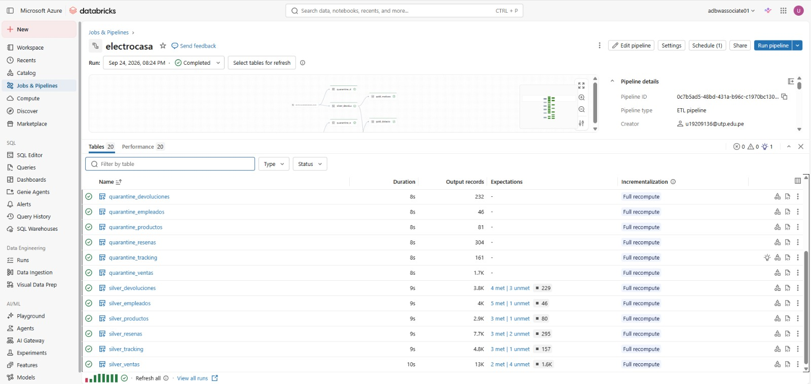
> 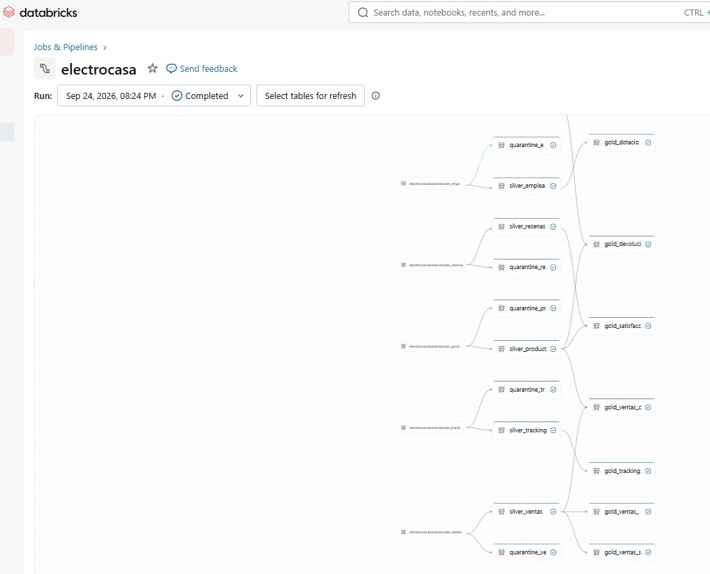
> 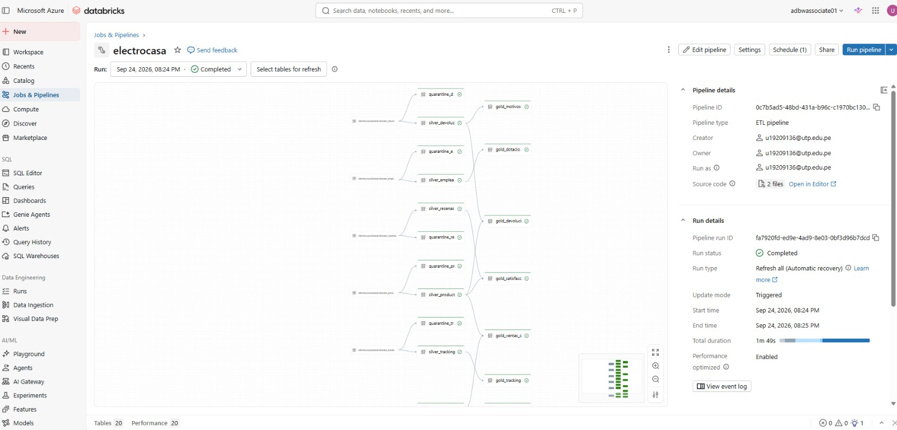

---

## 8. Calidad de datos

Se implementan expectativas de calidad para controlar reglas sobre campos críticos.

Ejemplos:

```text
Identificadores obligatorios
Salarios positivos
Fechas válidas
Estados válidos
Calificaciones válidas
Montos monetarios válidos
```

Los datos inválidos se separan hacia cuarentena en lugar de eliminarse silenciosamente.

```text
Dato válido
    ↓
  Silver

Dato inválido
    ↓
Quarantine
```

### Evidencia 9 — Expectativas

> 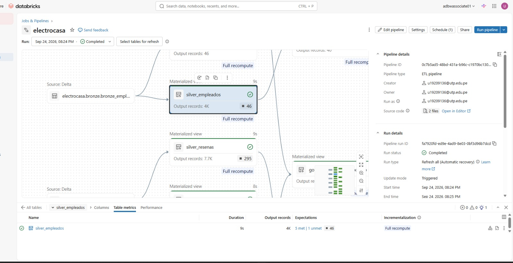
---

## 9. Cuarentena y trazabilidad

Se implementaron:

```text
quarantine_ventas
quarantine_productos
quarantine_empleados
quarantine_resenas
quarantine_devoluciones
quarantine_tracking
```

La cuarentena conserva trazabilidad para investigación y posible reprocesamiento.

Se busca conservar:

- Fuente.
- Motivo del rechazo.
- Timestamp.
- Registro original o campos relevantes.

### Evidencia  — Cuarentena

> 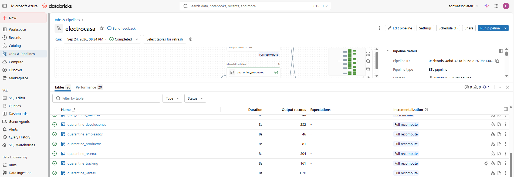

---

## 10. Historización de empleados

La fuente de RR. HH. contiene eventos:

```text
alta
transferencia
cambio_salario
baja
```

La capa Silver conserva los eventos para representar la evolución histórica del empleado.

Ejemplo:

```sql
SELECT
    id_empleado,
    tipo_evento,
    sucursal_id,
    salario,
    fecha_evento
FROM electrocasa.silver.silver_empleados
ORDER BY id_empleado, fecha_evento;
```

> ### Evidencia — Historización

> 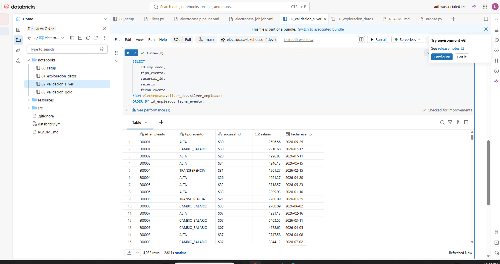

---

## 11. Capa Gold

Principales tablas:

```text
gold_ventas_mensuales
gold_ventas_sucursal
gold_ventas_categoria
gold_devoluciones_producto
gold_motivos_devolucion
gold_satisfaccion_producto
gold_dotacion_sucursal
gold_tracking_courier
```

Las salidas permiten analizar:

- Ventas por sucursal y período.
- Ticket promedio.
- Ventas por categoría.
- Productos con más devoluciones.
- Motivos de devolución.
- Satisfacción.
- Dotación por sucursal.
- Estados de entrega por courier.

> ### Evidencia  — Gold

> 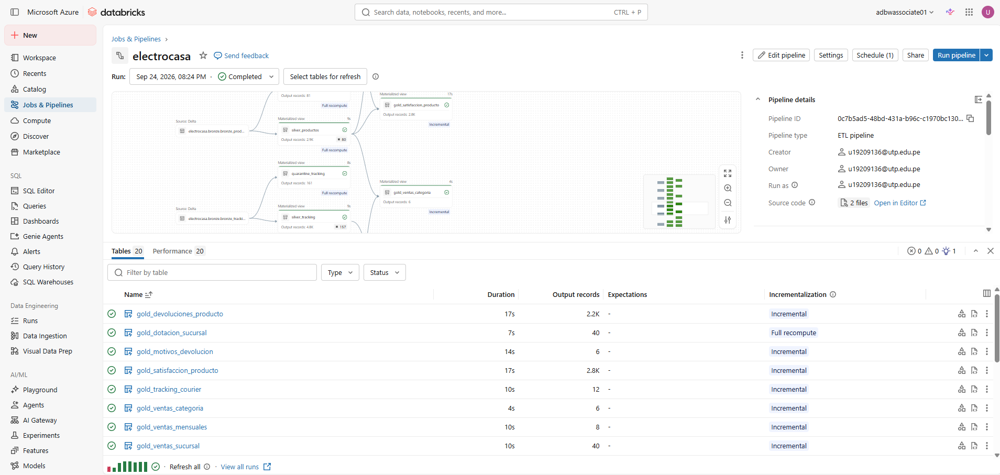
---

## 12. Lakehouse Federation

Tracking se consulta desde:

```text
electrocasa_sql.dbo.trackingenvios
```

Validaciones:

```sql
SHOW TABLES IN electrocasa_sql.dbo;

SELECT COUNT(*) AS total_registros
FROM electrocasa_sql.dbo.trackingenvios;
```

Las credenciales de la conexión no forman parte del código fuente.

### Evidencia — Tracking federado

> 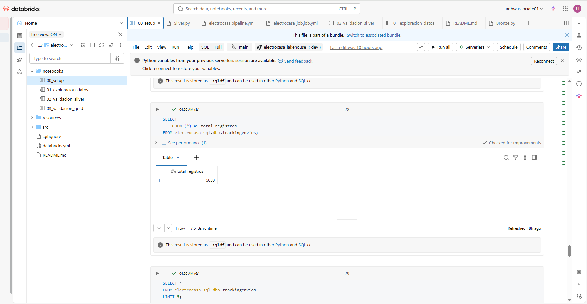

---

## 13. Unity Catalog

Catálogo:

```text
electrocasa
```

Schemas:

```text
electrocasa.bronze
electrocasa.silver
electrocasa.gold
```

También se utiliza un Volume para la zona de landing.

### Evidencia — Unity Catalog

> 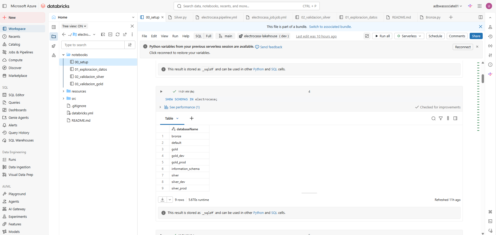

---

## 14. Grupos y permisos

Se definieron tres grupos:

| Grupo | Acceso |
|---|---|
| `electrocasa_ingenieria` | Lectura y escritura sobre Bronze, Silver y Gold |
| `electrocasa_analistas` | Solo lectura sobre Gold |
| `electrocasa_auditoria` | Solo lectura sobre Gold y acceso orientado a auditoría |

Se utilizan `GRANT` y `REVOKE`.

### Evidencia — Permisos

> 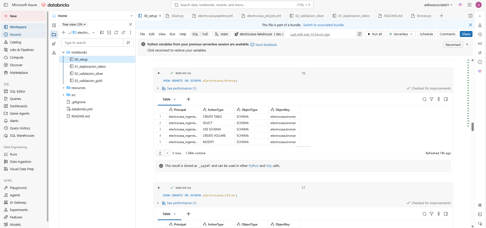
> 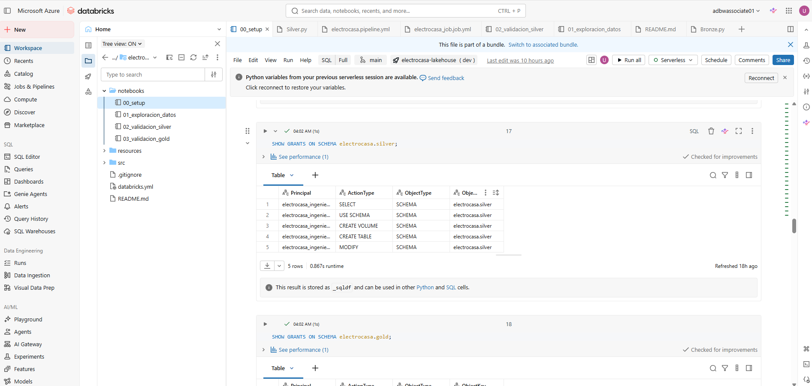
> 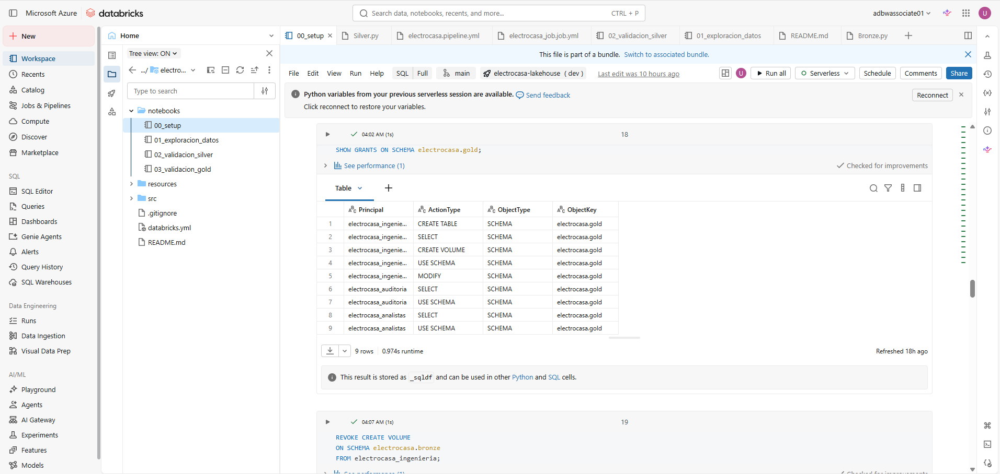
> 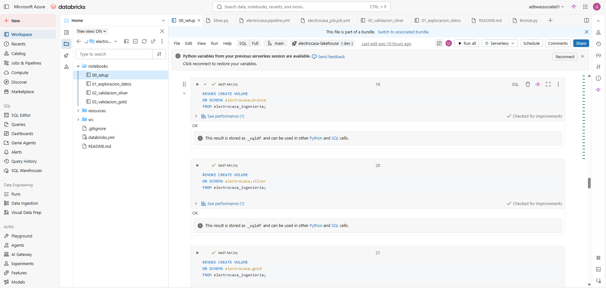
> 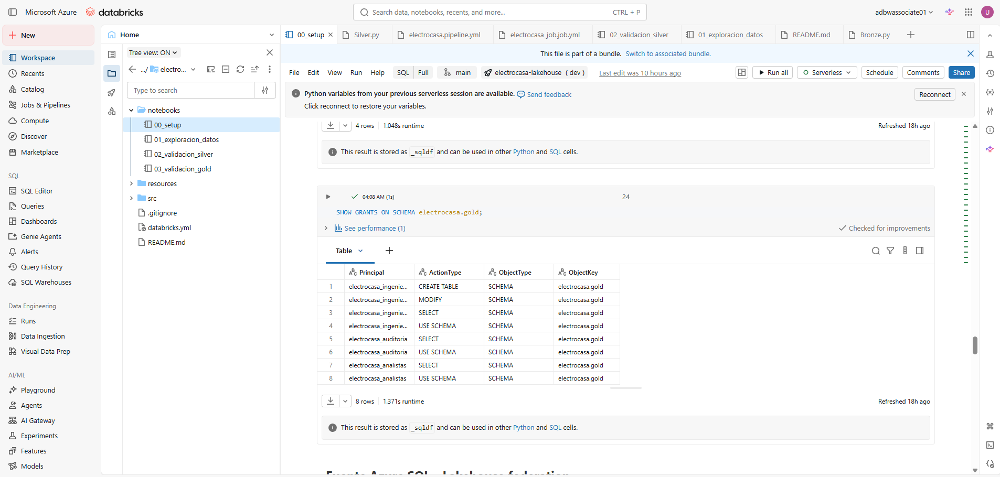
> 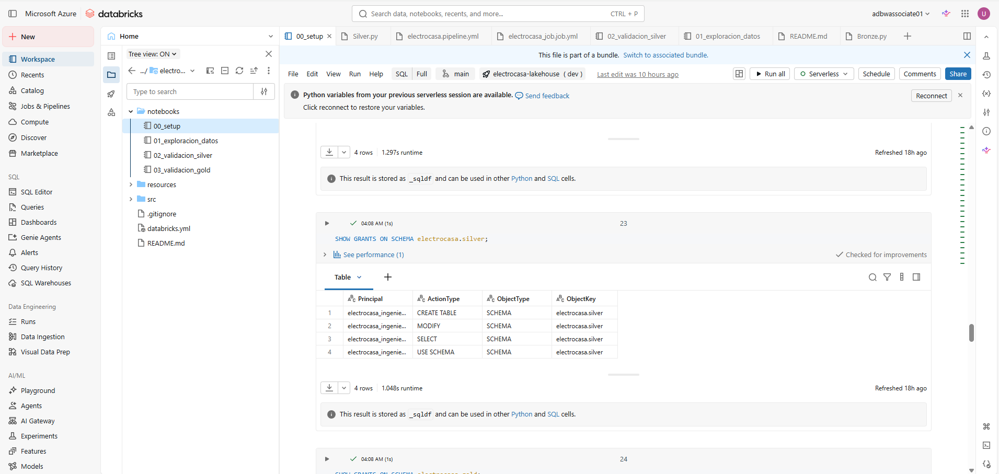
> 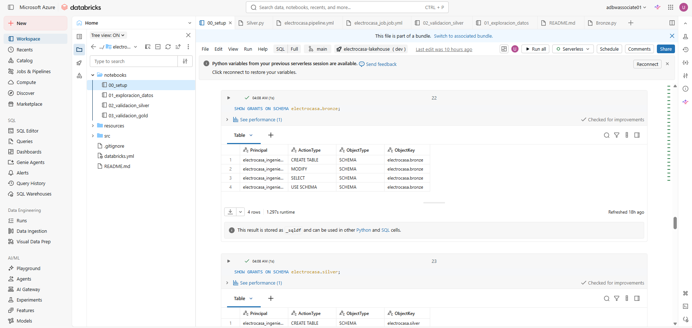

---

## 15. Masking de DNI y salario

Los campos sensibles son:

```text
dni
salario
```

El acceso depende del grupo.

```text
electrocasa_ingenieria
        ↓
    valor real

otros perfiles
        ↓
   valor protegido
```

Validación de grupo:

```sql
SELECT
    is_account_group_member('electrocasa_ingenieria') AS es_ingenieria;
```

### Evidencia — Definición del masking
> 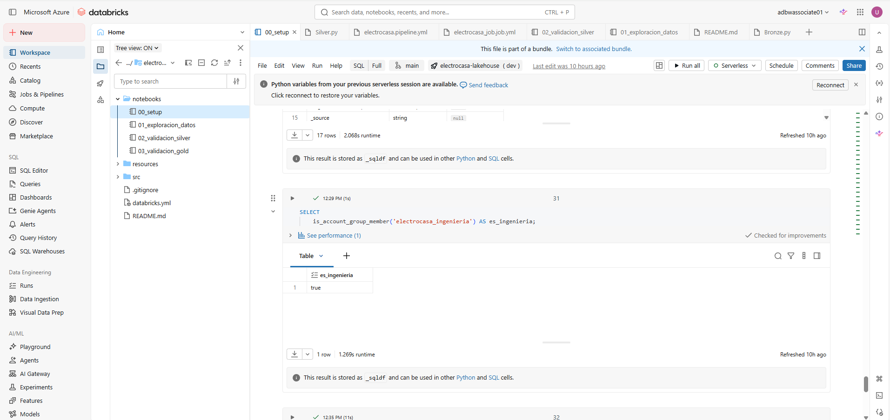

---

## 16. Orquestación con Lakeflow Jobs

Job:

```text
Electrocasa_job
```

Flujo:

```text
Bronze_ingestion
       ↓
Electrocasa_pipeline
```

### Bronze_ingestion

Tipo:

```text
Spark Python task
```

Ejecuta:

```text
src/electrocasa/transformations/Bronze.py
```

### Electrocasa_pipeline

Tipo:

```text
Pipeline task
```

Depende de `Bronze_ingestion`.

### Evidencia — Job

> 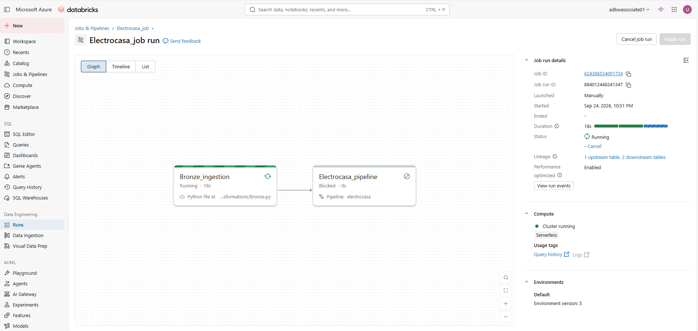
> 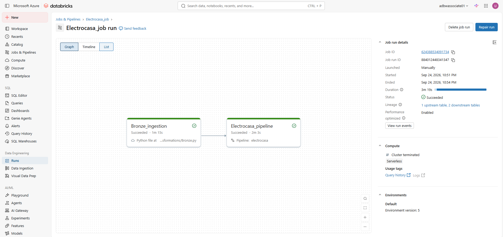
---

## 17. Reintentos

Configuración:

```yaml
max_retries: 2
min_retry_interval_millis: 60000
retry_on_timeout: true
```

El objetivo es mejorar la tolerancia frente a fallos transitorios.

### Evidencia — Retries y alertas

> 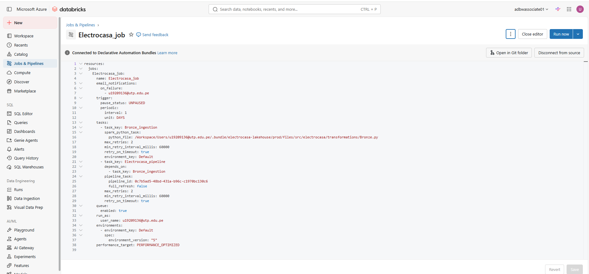

---

## 18. Alertas

Se configuró notificación ante fallos mediante:

```text
u19209136@utp.edu.pe
```

Esta alerta permite notificar al responsable cuando una ejecución no termina correctamente.

La evidencia puede compartirse con la configuración de retries.

---

## 19. Schedule

El Job se configuró como:

```text
Trigger type: Scheduled
Schedule type: Interval
Every: 1 Day
Status: Active
```

La frecuencia diaria es coherente con un proceso batch y evita mantener la plataforma ejecutándose continuamente.

### Evidencia — Schedule

> 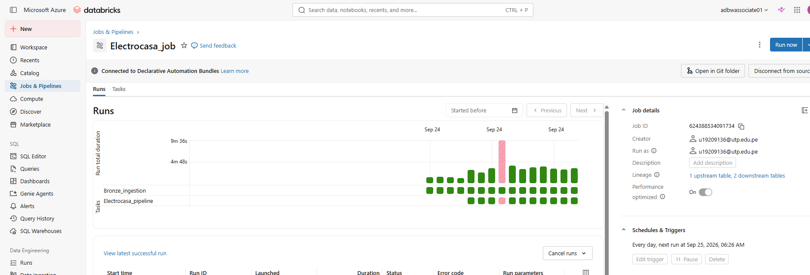

---

## 20. Cómputo y costos

Se utiliza Serverless para los recursos configurados.

La decisión se justifica por:

- Ejecuciones periódicas.
- Volumen moderado.
- Ausencia de necesidad de cluster permanente.
- Reducción de capacidad ociosa.
- Simplificación operativa.

La estimación exacta del costo depende del consumo real del workspace.

### Evidencia 21 — Compute y costos

> 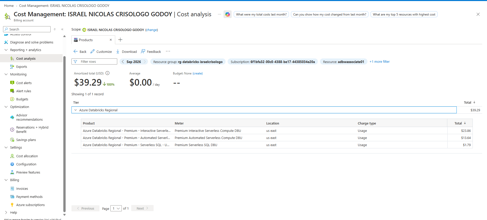

---

## 21. Declarative Automation Bundle

El proyecto utiliza Declarative Automation Bundles.

Archivo:

```text
databricks.yml
```

Recursos:

```text
resources/
├── electrocasa.pipeline.yml
└── electrocasa_job.yml
```

Targets:

```text
dev
prod
```

Flujo:

```text
validate
   ↓
deploy dev
   ↓
run / validar
   ↓
deploy prod
   ↓
run / validar
```

### Evidencia — Bundle DEV

> 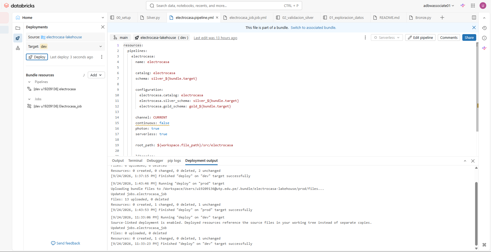

### Evidencia 23 — Bundle PROD

> 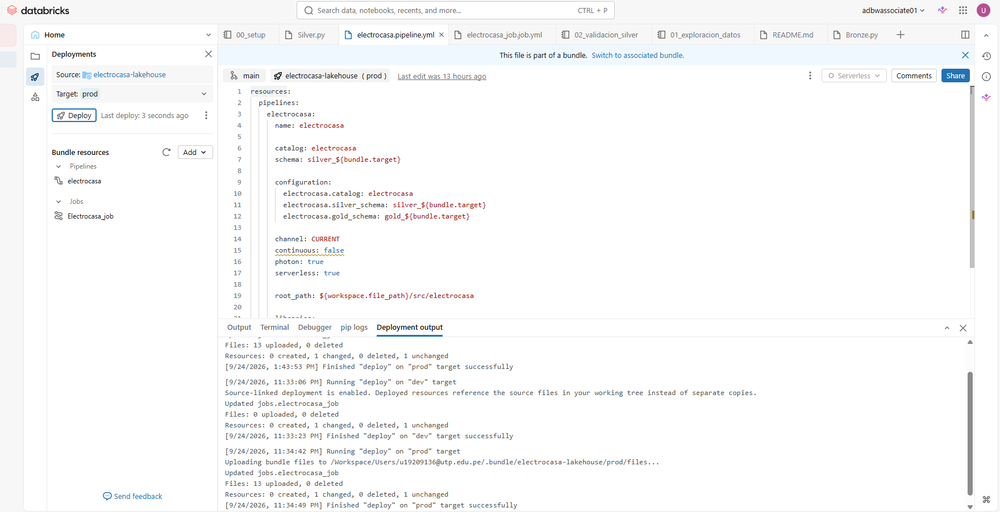

---

## 22. Monitoreo

Se revisaron:

- Historial de Jobs.
- Estado de las tareas.
- Duración.
- Estado del Pipeline.
- Métricas de expectativas.
- Tablas de cuarentena.
- Resultados Gold.

### Evidencia — Monitoreo del Job

> 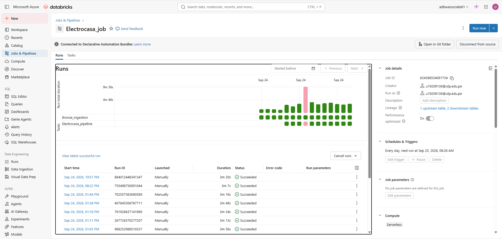

### Evidencia 25 — Monitoreo del Pipeline

> 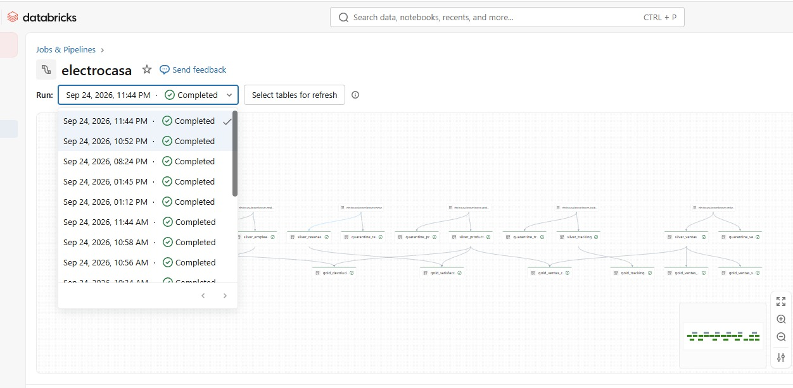

---

## 23. Ejecución end-to-end

La ejecución final debe demostrar:

```text
Bronze_ingestion
       ✅
       ↓
Electrocasa_pipeline
       ✅
       ↓
Silver
       ✅
       ↓
Gold
       ✅
```

### Evidencia 27 — Job final

**Captura:** `docs/evidencias/27_ejecucion_final_job.png`

**Qué debe mostrar:** Job completo con ambas tareas en `Succeeded`.

> ``

### Evidencia 28 — Pipeline final

**Captura:** `docs/evidencias/28_ejecucion_final_pipeline.png`

**Qué debe mostrar:** Pipeline finalizado correctamente.

> ``

---

## 25. Troubleshooting

Durante el desarrollo se presentaron y resolvieron incidencias relacionadas con:

- Variables del Bundle.
- Configuración de tareas.
- Entornos de ejecución.
- Imports de Python.
- Configuración de Pipeline.
- Deploy declarativo.

El procedimiento utilizado fue:

```text
Identificar error
      ↓
Aplicar cambio mínimo
      ↓
Validar Bundle
      ↓
Deploy DEV
      ↓
Ejecutar
      ↓
Verificar
      ↓
Deploy PROD
```

Este enfoque permite reducir el riesgo de introducir cambios simultáneos y facilita la identificación de errores.

---

## Conclusión

El proyecto ElectroCasa implementa una plataforma de datos de extremo a extremo sobre Microsoft Azure Databricks.

La solución integra seis fuentes mediante distintos mecanismos de ingesta y organiza el procesamiento bajo una arquitectura Medallion.

Bronze concentra la ingestión y trazabilidad; Silver aplica limpieza, calidad, cuarentena, deduplicación, historización y protección de información sensible; y Gold genera resultados preparados para análisis de negocio.

Unity Catalog proporciona gobierno sobre catálogos, schemas, volúmenes, permisos y datos sensibles.

Lakeflow Jobs permite orquestar la ejecución mediante tareas dependientes, retries, alertas y programación diaria.

Finalmente, Declarative Automation Bundles permite gestionar el código y los recursos del proyecto como configuración versionada y desplegar de forma reproducible entre `dev` y `prod`.

La solución queda respaldada por evidencias de ejecución, calidad, seguridad, monitoreo y despliegue.
